# Proyecto "Clinica"

El proyecto "Clinica" es un sistema de gestión para una clínica médica. Está compuesto por los siguientes componentes:

1. **Base de datos:** Se utiliza una base de datos relacional para almacenar la información de los pacientes, médicos, citas, historias clínicas, entre otros.

2. **Interfaz de usuario:** Se desarrolla una interfaz de usuario intuitiva y fácil de usar, que permite a los usuarios acceder y gestionar la información de la clínica de manera eficiente.

3. **Módulo de gestión de pacientes:** Permite registrar y administrar la información de los pacientes, incluyendo datos personales, historias clínicas, tratamientos, entre otros.

4. **Módulo de gestión de médicos:** Permite gestionar la información de los médicos, incluyendo datos personales, especialidades, horarios de atención, entre otros.

5. **Módulo de gestión de citas:** Permite programar y gestionar las citas de los pacientes con los médicos, incluyendo la asignación de horarios, recordatorios, entre otros.

6. **Módulo de facturación:** Permite generar y gestionar las facturas de los servicios médicos prestados, incluyendo la generación de reportes y estadísticas.

7. **Módulo de historias clínicas:** Permite almacenar y gestionar las historias clínicas de los pacientes, incluyendo diagnósticos, tratamientos, medicamentos recetados, entre otros.

Estos componentes trabajan en conjunto para proporcionar una solución integral de gestión para la clínica, mejorando la eficiencia y la calidad de atención médica.

## PANTALLA LOGIN

Desde aquí podremos loguearnos al sistema y elegir ingresar o ir a registro.
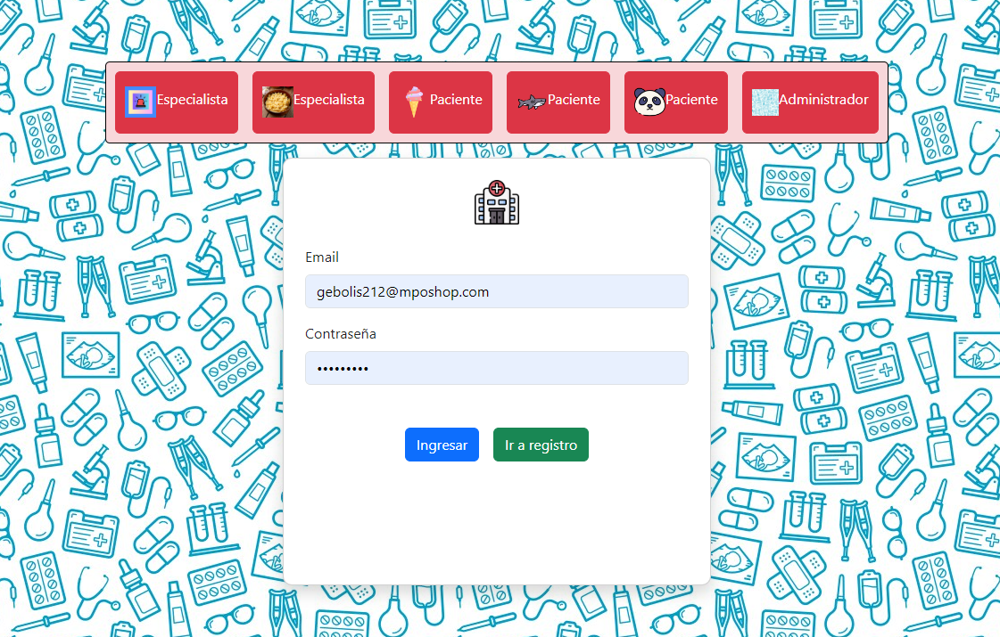

## PANTALLA ELECCION DE USUARIO

Desde aquí podremos elegir qué usuario registrar.
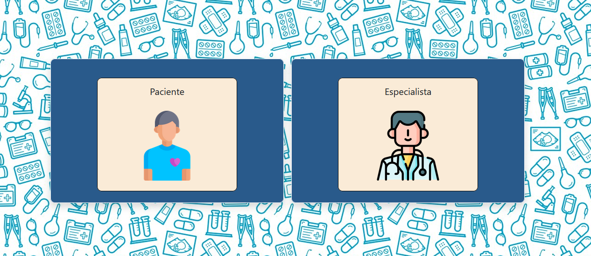

### Elección Especialista

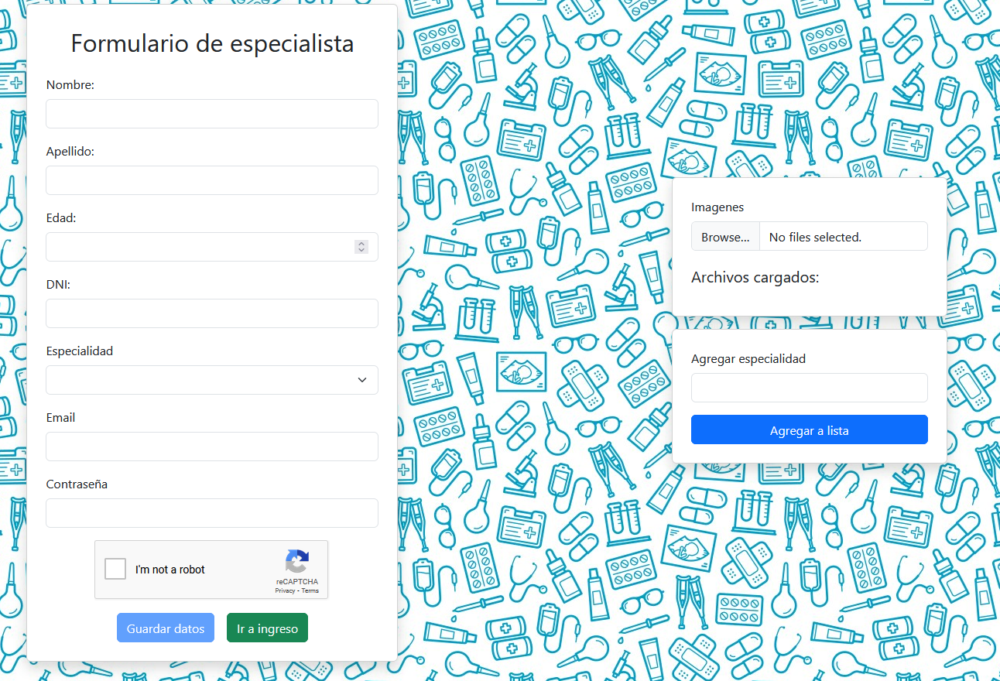

### Elección Paciente

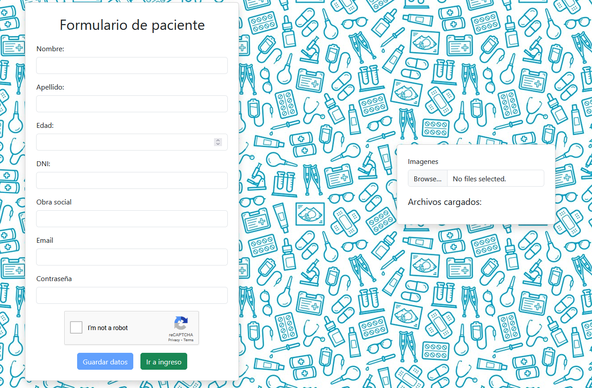

## Paciente

El paciente podrá seleccionar turnos desde la app.
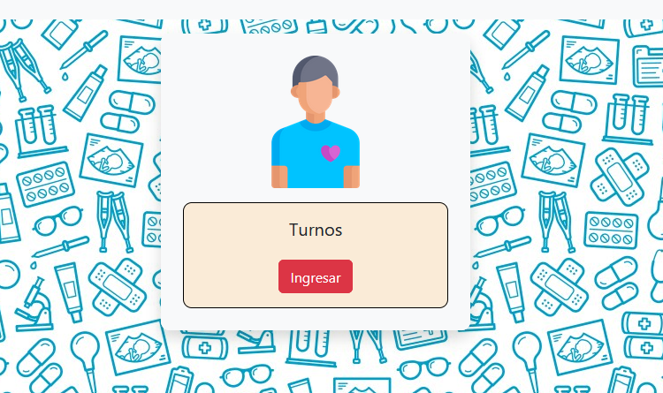

### Elección de Especialidad

Tocando al especialista podrá elegir el horario que quedará reflejado en la tabla de turnos.
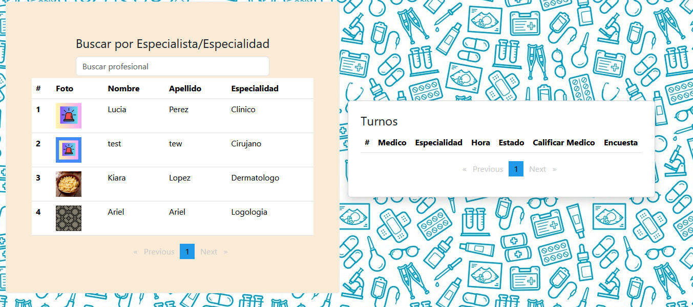
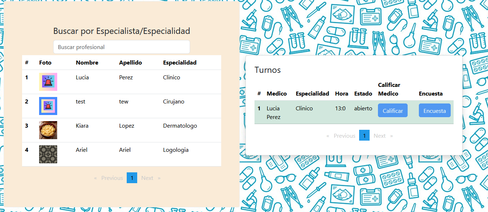

### Caso de cancelar

En caso de cancelar deberá tocar en el turno y informar el motivo.

### Realizado el turno

Una vez realizado el turno, el paciente podrá calificar y encuestar al médico.
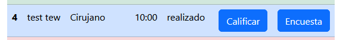

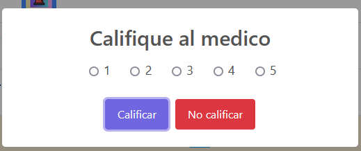

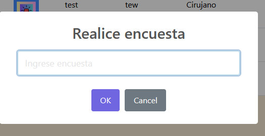

## Especialista

Podrá entrar a la app de especialista para gestionar los turnos.
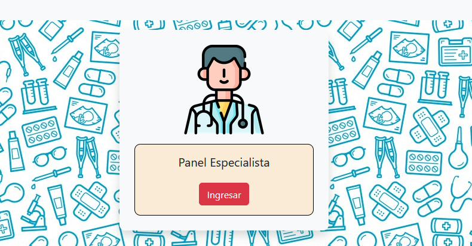

Apretando en el paciente podrá elegir qué opción tomar.
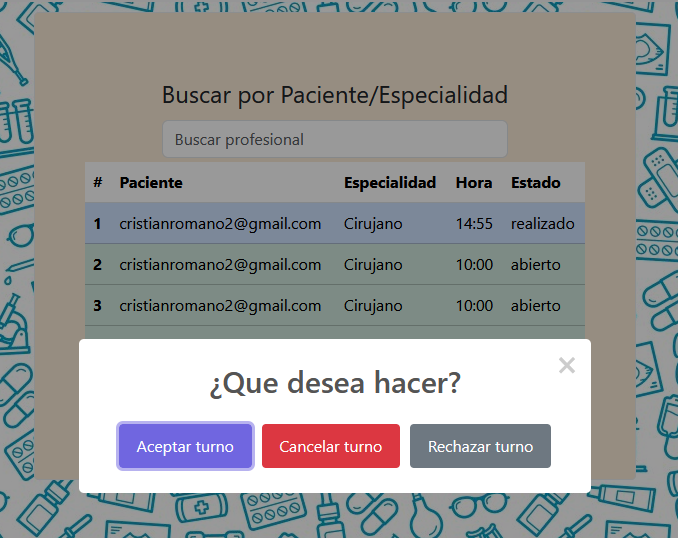

### RECHAZO

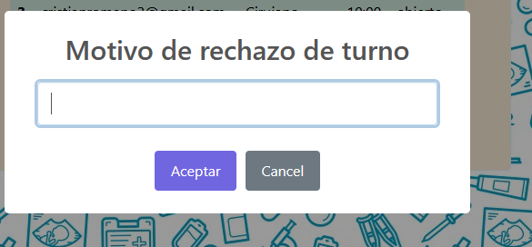

### CANCELAR

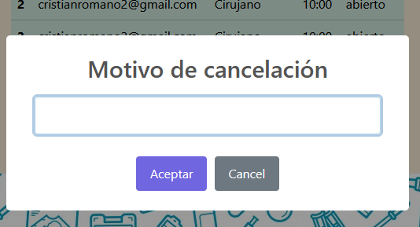

### ACEPTAR

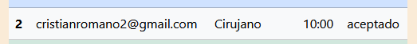

Una vez realizado el turno, deberá dejar una nota con el diagnóstico y comentario.
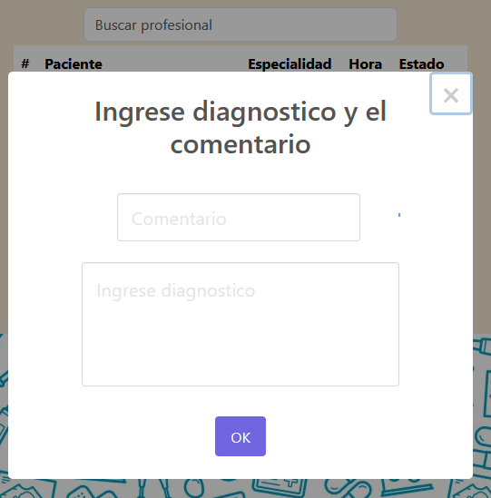

### RESEÑA

El especialista podrá ver la reseña del paciente.
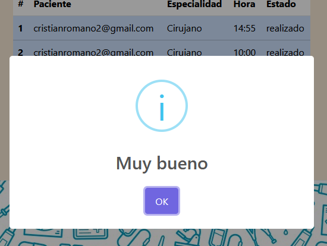

## Administrador

### CANCELAR TURNOS

El administrador podrá cancelar turnos desde la app de turnos administrador.
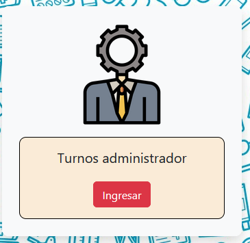

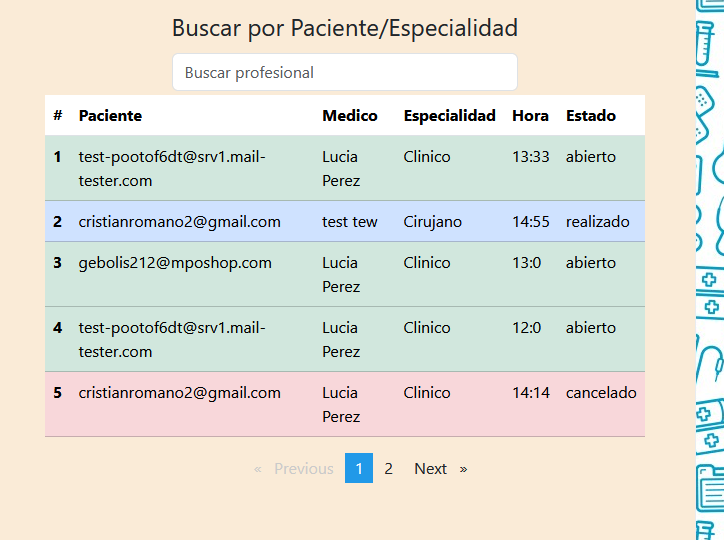

### GESTIONAR TURNOS PACIENTE

El administrador podrá gestionarle un turno al paciente desde la app turnos, la manera es eligiendo al paciente y luego al especialista.
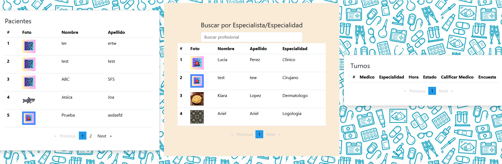

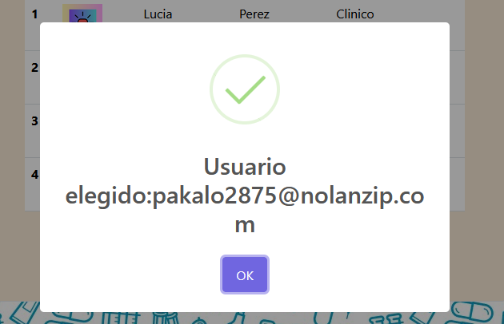

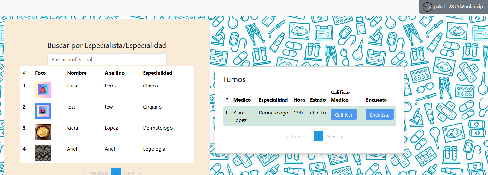

### GESTIONAR AUTORIZACIONES

Desde el panel de usuario podrá autorizar especialistas.
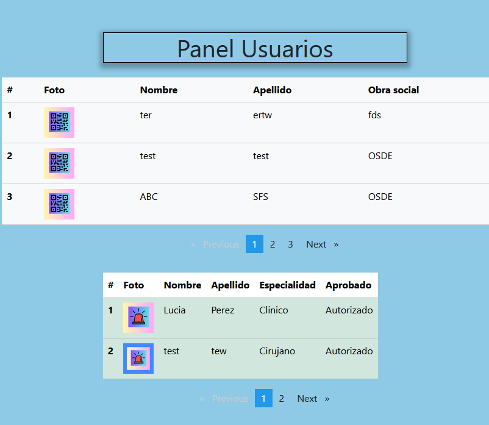
